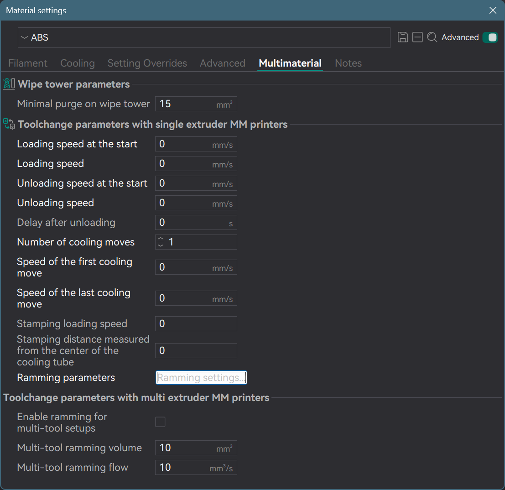

### Configuring your slicer

The recommended slicer for AFC is OrcaSlicer. Other slicers such as PrusaSlicer or SuperSlicer may be used, and the
configuration of options within them is similar but naming or options may be slightly different.

#### Updating printer settings in Orca

For the printer you are adding BoxTurtle to, first go to the Printer settings, Multimaterial tab and ensure settings are
configured as per the below screenshot.


Also, on the Extruder 1 setting page - reduce `Retraction while switching material` length from the default of 2 to
0.

#### Adding additional filaments/extruders

Increase the number of filaments to match your BoxTurtle's lane count.


#### Updating the Machine G-code settings

- Set `Machine start G-code` appropriately for your printer, specifically adding the `TOOL={initial_tool}` to your `
  PRINT_START` macro.

``` g-code
M104 S0 ; Stops OrcaSlicer from sending temperature waits separately
M140 S0 ; Stops OrcaSlicer from sending temperature waits separately
PRINT_START EXTRUDER=[nozzle_temperature_initial_layer] BED=[bed_temperature_initial_layer_single] TOOL={initial_tool}
```

- Set `Change Filament G-Code` to the below value. Remove any other custom code here, e.g. extruder moves.

``` g-code
T[next_extruder] PURGE_LENGTH=[flush_length]
;FLUSH_START
;EXTERNAL_PURGE {flush_length}
;FLUSH_END
```

### Changes when using PrusaSlicer

For the most part, many of the above settings are also applicable to other Slic3r derivatives such as PrusaSlicer or
SuperSlicer. Below are a list of some of the deviations. Reth also created a very good summary of the overview of tuning
changes for PrusaSlicer in [this video](https://www.youtube.com/watch?v=ilxtHVNhsM4).

- Instead of 'Change Filament G-Code', update the 'Tool Change G-Code' in printer settings to the below.

``` g-code
T[next_extruder]
```

- Under each extruder in printer settings, change the default value of 'Retraction when tool is disabled' from 10mm to
  0.5mm.

#### Additional Slicer configuration - pre-OrcaSlicer 2.2.0

Configuring per-material filament ramming is no longer required as of the official OrcaSlicer 2.2.0 release (
PR [#6934](https://github.com/SoftFever/OrcaSlicer/pull/6934)). If you are on an earlier version than that (including
betas/release candidates) you will need to make the following additional changes to your slicer configurations.

#### Material Settings



##### Ramming Settings

Because the AFC-Klipper-Add-On handles any tip forming in the extension, we need to disable these specific settings in
the slicer software. Below is a screenshot for OrcaSlicer, but most Slic3r-based slicers have a similar dialog/setting.
